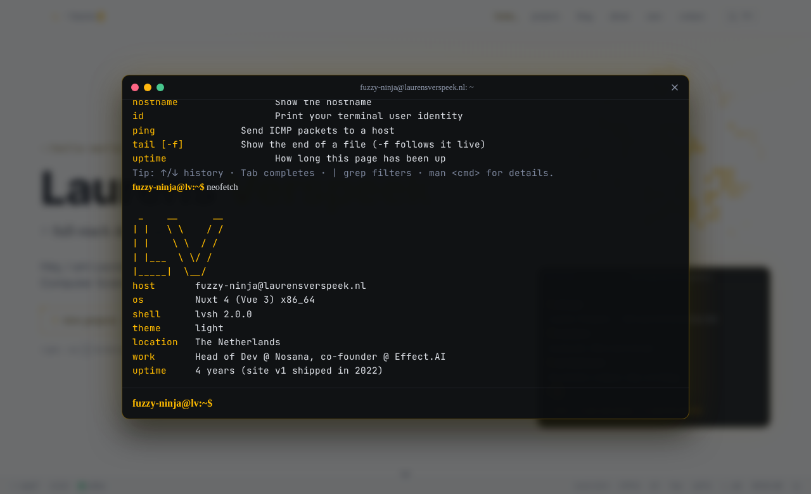
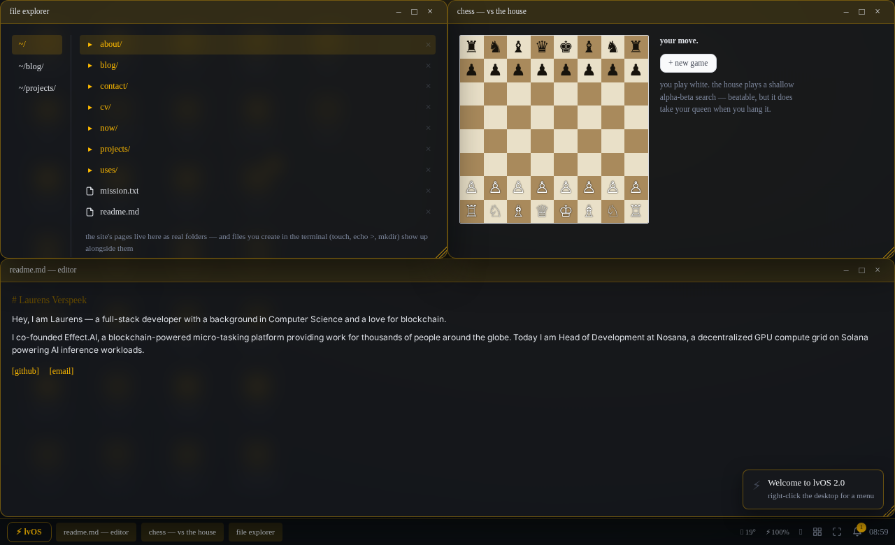
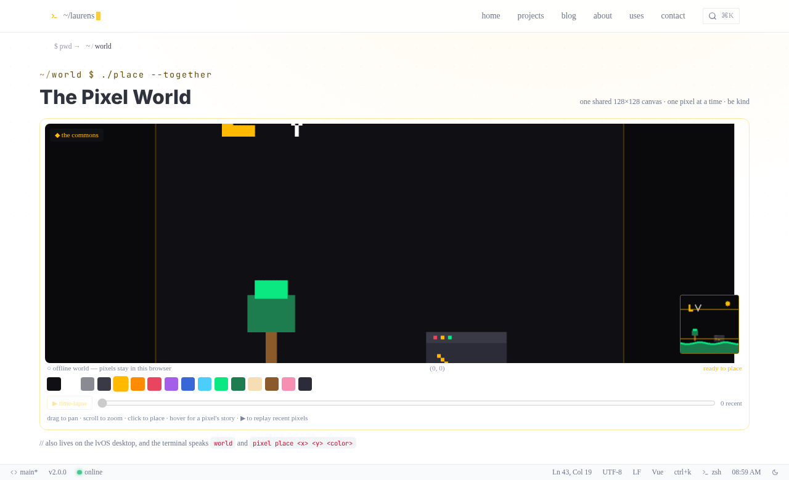

# laurensverspeek.nl

[](https://github.com/laurensV/laurensverspeek.nl/actions/workflows/deploy_gh-pages.yml)

Personal portfolio of Laurens Verspeek — built with [Nuxt 4](https://nuxt.com), TypeScript and [Bulma 1](https://bulma.io).

A minimalist developer portfolio on the surface, with an unusual amount hidden a keystroke away.

| the terminal | lvOS | the pixel world |
| --- | --- | --- |
|  |  |  |

## The terminal

Press <kbd>~</kbd> (or <kbd>`</kbd>) anywhere to open the interactive shell. It is the centerpiece — a real command interpreter shared by the navbar, footer and the lvOS desktop.

- **Navigate & read** — `about`, `projects`, `blog`, `now`, `uses`, `cv`, `contact`, `github`, `stats`, `changelog`, `search <term>` (full-text over blog posts), `open <thing>`.
- **A persistent virtual filesystem** — `ls`, `cd` (incl. `cd -`, `pushd`/`popd`), `pwd`, `tree`, `cat`, `mkdir`, `touch`, `rm`, `cp`, `mv` — with `*` wildcards, and it survives across visits. Edit files with the real **`nano`** and modal **`vim`**/`vi`. Anything you `rm` lands in the lvOS **recycle bin**, restorable from the desktop.
- **Pipes, redirection & scripts** — `help | grep blog | sort | uniq | wc`, `… > file`, `… >> file`, `… | copy` to the clipboard, chaining with `&&`/`||`/`;`, and real **shell scripts**: write lines to a file and run them with `sh file.sh` (with an `sh -x` trace and a fork-bomb guard).
- **tmux panes** — <kbd>Ctrl</kbd>+<kbd>B</kbd> then `%` or `"` splits the terminal into up to four panes with independent scrollback; arrows move focus, `x` closes. `tmux` works too.
- **Shell niceties** — history (<kbd>↑</kbd>/<kbd>↓</kbd>, <kbd>Ctrl</kbd>+<kbd>R</kbd> reverse search, `!!`/`!n`/`!prefix` expansion), `alias`/`export` (persisted), tab completion, `man` (with SEE ALSO), `which`, `fontsize` (or <kbd>Ctrl</kbd>+<kbd>=</kbd>/<kbd>-</kbd>), grouped `help`, an animated braille spinner on anything async.
- **`git`** — replays this repo's real commit history (`git log`, `git show <sha>`), baked at build time. Also surfaced at `/changelog` with GitHub-style diffstat blocks.
- **One process table** — `ps`/`kill`/`top` see everything: terminal effects, **open lvOS windows**, and the running game or editor, with the same pids the desktop task manager shows. `kill` really closes windows, ends games — and `kill 7` terminates your own shell.
- **Toys & effects** — `cowsay`, `figlet`, `fortune`, `weather [city]`, `qr [text]`, `matrix`, `crt`, `sl`, `party`, `fireworks`, `sysinfo`/`neofetch`, `df`/`du`, `battery`, `volume`, `music` (the shared chiptune jukebox), `contributions` (a GitHub heatmap), `asciicam` (webcam → ASCII), `asciiquarium`, and `globe` — a spinning ASCII earth plotting live visitors by timezone.
- **Games** — `snake`, `tetris` (with hold + ghost), `2048`, `pong`, `hangman`, `wpm` typing test, `chess`, `top`, Conway's `life`, and `adventure` — a text adventure where the site is the dungeon (autosaves, includes a grue). Every game's high score feeds one hall of fame (and mints coins for your pet).
- **Multiplayer** (when the relay is on) — `chat` joins the `#lounge`, and `pong online`, `wpm race` and online chess match you against a live visitor, refereed by a server-authoritative relay (they fall back to solo play otherwise). `mail` shares the lvOS inbox; `bug` opens a prefilled GitHub issue.
- **Hidden ones** — `secrets` lists them. Includes `ssh`, `sudo`, `do a barrel roll`, `destroy` (a ship that shoots the actual DOM to bits; <kbd>Esc</kbd> repairs it), `boss` (or <kbd>b</kbd><kbd>b</kbd>: instant spreadsheet until the coast is clear), `emacs` (three-stage refusal), `pet` (a tamagotchi that lives in the status bar, hatches, sleeps at night, sulks when unfed, and spends its coins on hats), `museum` (the `/museum` catalog of everything), telnet Star Wars, and `say` (a speech bubble on your live cursor).

## lvOS — a desktop in a route

Run `desktop` / `startx`, or visit `/desktop`. A BIOS boot (press <kbd>DEL</kbd> during POST for a real settings screen), then a windowing environment: draggable/resizable windows with edge & corner snapping (also <kbd>Ctrl</kbd>+<kbd>Alt</kbd>+arrows), <kbd>Alt</kbd>+<kbd>Tab</kbd>, tile-all from the start menu, a run dialog (<kbd>Alt</kbd>+<kbd>R</kbd>, with tab completion), a taskbar with peek previews, a volume tray and a weather chip, notifications, a genie minimize, right-click menus (with pin-on-top), a lock screen, an idle screensaver gallery (starfield / flying toasters / mystify), a night-light wash, shutdown/reboot with a CRT power-off, a System Update screen that installs this repo's real commits, live wallpapers (Paint drawings included), an About This Computer with real uptime/specs, and a <kbd>?</kbd> shortcut sheet. Arrow keys walk the icon grid. Apps include a terminal (the same shell), file explorer (same VFS, drag-and-drop, right-click to rename or bin files), recycle bin, blog reader, mail (with compose), a feed reader, chat, a code playground, browser, paint, notes, calculator, clock, camera, Minesweeper, Game of Life, snake, chess (vs AI or a live visitor), the visitor globe, an image gallery, a hall of fame, a system monitor, displays, a task manager (windows, terminal effects and games as killable processes), settings and vim — editing the same `notes.txt` the terminal sees.

## The rest of the site

- **Blog** — markdown via [Nuxt Content](https://content.nuxt.com) with Shiki highlighting, TOC + scrollspy, reading time, copy buttons, deep-link anchors, called-out lines, related posts, clickable hue-coded tags with shareable `?tag=` filters, a full-content RSS feed, and Web Share.
- **Vim-style navigation** — <kbd>j</kbd>/<kbd>k</kbd> scroll, <kbd>gg</kbd>/<kbd>G</kbd> jump, `gh`/`gb`/`gp` go to home/blog/projects.
- **Command palette** — <kbd>Ctrl</kbd>+<kbd>K</kbd> / <kbd>⌘K</kbd> fuzzy search over pages, posts, projects and actions.
- **Details** — an interactive Game of Life hero (with a pointer trail), a working VS Code-style status bar (clock, presence, EOL/language toys, optionally a pet), `pwd` breadcrumbs, a time-aware greeting, theme-aware favicon (which becomes a prompt while the terminal is open), native **view transitions** (project cards morph into their detail pages), an interactive 404 recovery shell (with a hidden `play`), a downloadable vCard + ASCII QR on `/contact`, live GitHub stats that count up on scroll, print-optimized `/cv`, per-page OG cards generated at build time, `humans.txt` + `security.txt`, breadcrumb & article JSON-LD, an offline page with a playable snake, and git-derived "last updated" dates.
- **Meta pages** — `/museum` catalogs every feature and easter egg as exhibits (and you can walk the floor as an avatar); `/stats` draws the public visitor counters; `/changelog` is the real git history; `/keyboard` is the shortcut reference; `/til` is a micro-blog; a PGP scaffold gates `/pgp.txt`.
- Dark/light theme throughout, reduced-motion respected everywhere, filterable projects with detail pages, `/uses` and `/now`.

## Architecture

The guided tour — terminal internals, the shared process table, lvOS, and the
build pipeline — lives in [docs/architecture.md](docs/architecture.md).

The optional realtime server (live cursors + the Pixel World) has its own guide:
[docs/world-server.md](docs/world-server.md).

## Development

```bash
npm install
npm run dev              # dev server on http://localhost:3000
npm run lint             # eslint
npm run typecheck        # vue-tsc over the app
npm run typecheck:tests  # vue-tsc over tests/
npm run typecheck:scripts # checkJs over scripts/ and realtime/
npm run test             # vitest unit tests
npm run test:e2e         # playwright (needs `npm run generate` first)
npm run knip             # unused files / exports / deps
```

A pre-commit hook runs eslint on staged files (husky + lint-staged).

## Production

```bash
npm run generate   # static site in .output/public
npm run preview    # preview the production build
```

Deployed to GitHub Pages automatically on push to `main`; pull requests run the full check suite without deploying (see `.github/workflows/deploy_gh-pages.yml`).

## Optional integrations

Both are **off by default** and activate via environment variables at build time:

- **Analytics** (privacy-first, no cookies): create a free [GoatCounter](https://www.goatcounter.com) account and set
  `NUXT_PUBLIC_GOATCOUNTER=<your-code>` (or the `GOATCOUNTER_CODE` repo variable, which CI passes through). Enables page
  views, anonymous terminal-command usage events, and the terminal `stats` command.
- **Live visitor cursors & the multiplayer layer**: deploy the tiny relay in `realtime/cursors-server.mjs` to any Node host
  (`node realtime/cursors-server.mjs`, board persisted to disk, otherwise no accounts or tracking) and set `NUXT_PUBLIC_CURSORS_WS=wss://your-host`.
  Only anonymous viewport positions and a UTC offset are relayed. Unlocks the "N browsing" badge (click it to toggle other cursors), `say`,
  the pixel world, the `#lounge` chat, online pong/chess/typing races, the global leaderboard and the visitor globe. Deploy notes:
  [docs/world-server.md](docs/world-server.md); `npm run test:relay` boots it and drills every subsystem.

## Editing content

- Blog posts: `content/blog/*.md` (frontmatter: `title`, `date`, `description`, `tags`)
- Projects (incl. detail-page stories): `app/data/projects.ts`
- Bio, skills, timeline, socials: `app/data/profile.ts`
- Uses page: `app/data/uses.ts`
